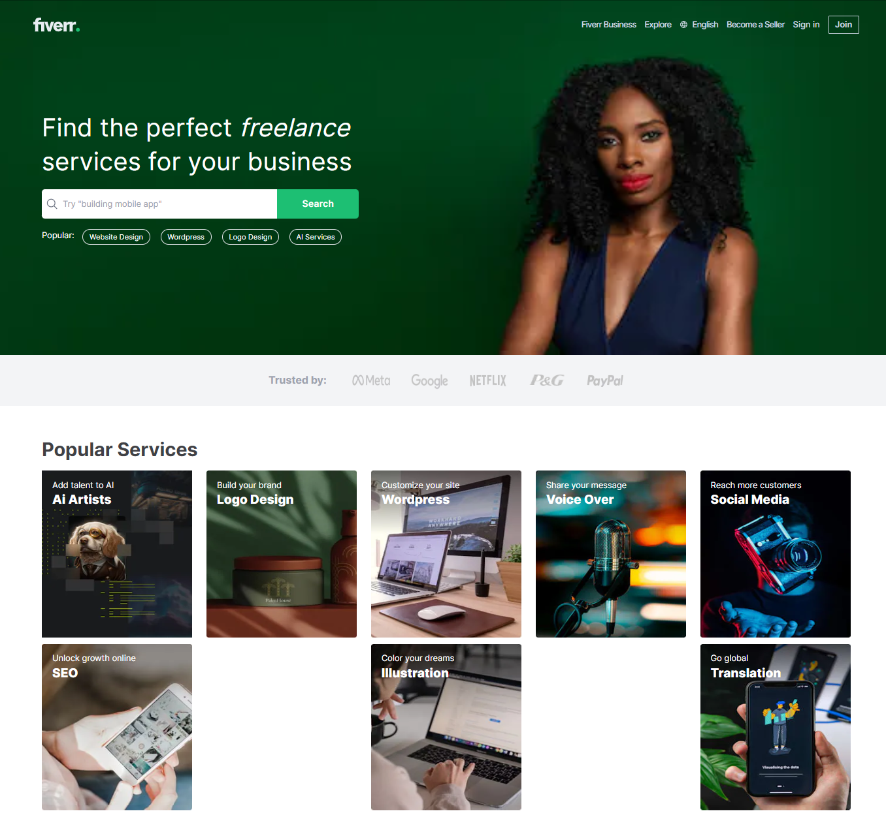

# Fiverr Clone



## Description

This project is a clone of the popular freelancing platform Fiverr. It includes features such as user authentication (login and register), creating and updating gigs, profile management, etc.

## Technologies Used

- Node.js
- Express.js
- MongoDB
- Prisma
- Next.js 14
- Tailwind CSS
- Cloudinary
- Stripe

## Usage

- Register or login to start using the platform.
- Create gigs to offer your services.
- Browse gigs posted by other users.
- Purchase gigs using Stripe integration.

## Server Setup

1. Navigate to the server directory:

   ```bash
   cd fiverr-clone/server
   ```

2. Install dependencies:

   ```bash
   npm install
   ```

3. Set up environment variables:

   Create a `.env` file in the server directory and add the following variables:

   ```
   PORT = 5050
   PUBLIC_URL = https://localhost:3000
   DATABASE_URL=
   ACCESS_TOKEN_SECRET = qwerouop1u35-98fal6LF5!%!@^AS
   ACCESS_TOKEN_EXPIRE_IN = 7d
   ```

4. Push Prisma schema to the database:

   ```bash
   npx prisma db push
   ```

5. Start the server:

   ```bash
   npm start
   ```

6. The server will be running on `http://localhost:5000`.

## Client Setup

1. Navigate to the client directory:

   ```bash
   cd fiverr-clone/client
   ```

2. Install dependencies:

   ```bash
   npm install
   ```

3. Start the client:

   ```bash
   npm run dev
   ```

4. Open your browser and navigate to `http://localhost:3000`.

## Live Demo

View the live demo [fiverr-clone](https://fiverr-clone-alpha.vercel.app/).

## Video Demo

View the video demo [here](insert_live_link).

## Contributing

Contributions are welcome! Feel free to open a pull request or submit an issue.

## Contact

For any inquiries, you can reach me via [LinkedIn](https://www.linkedin.com/in/developer-shajib).

## License

This project is licensed under the [MIT License](LICENSE).
